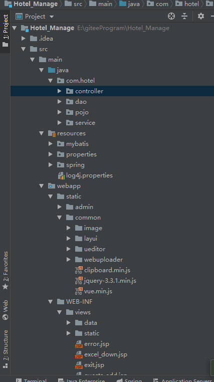
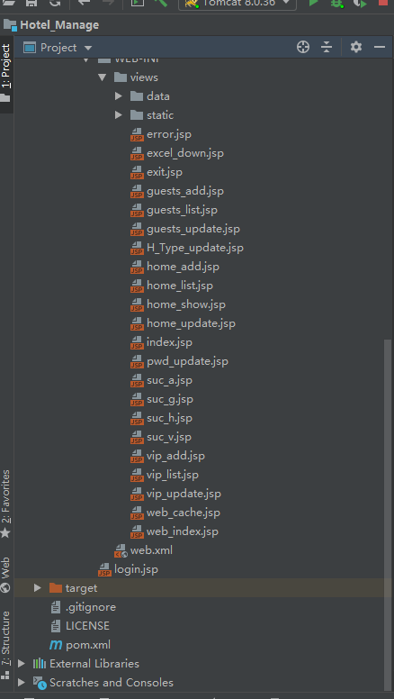
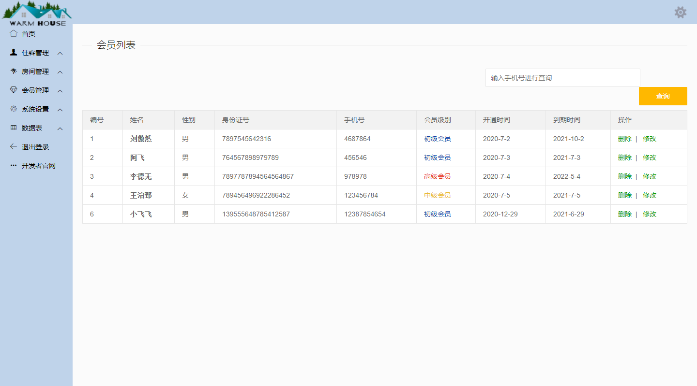
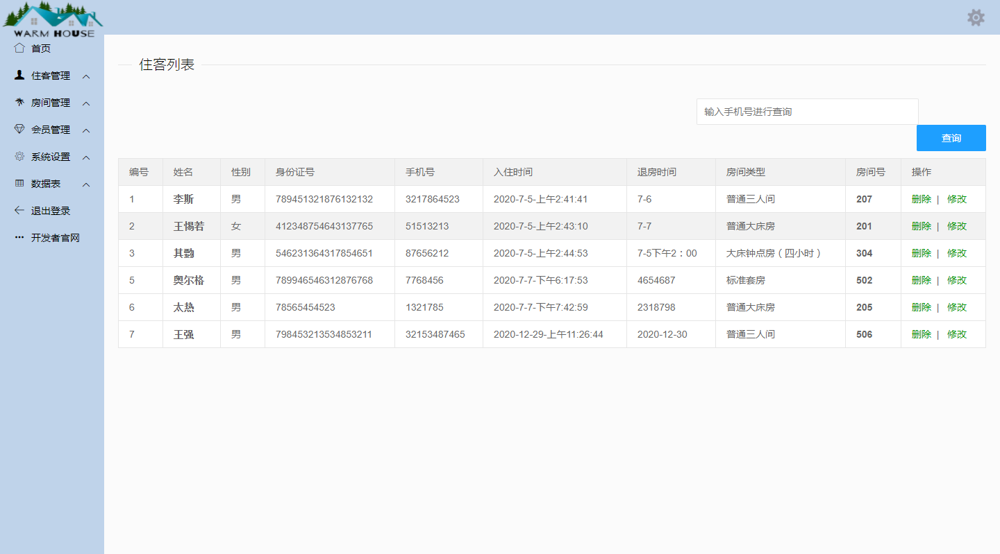
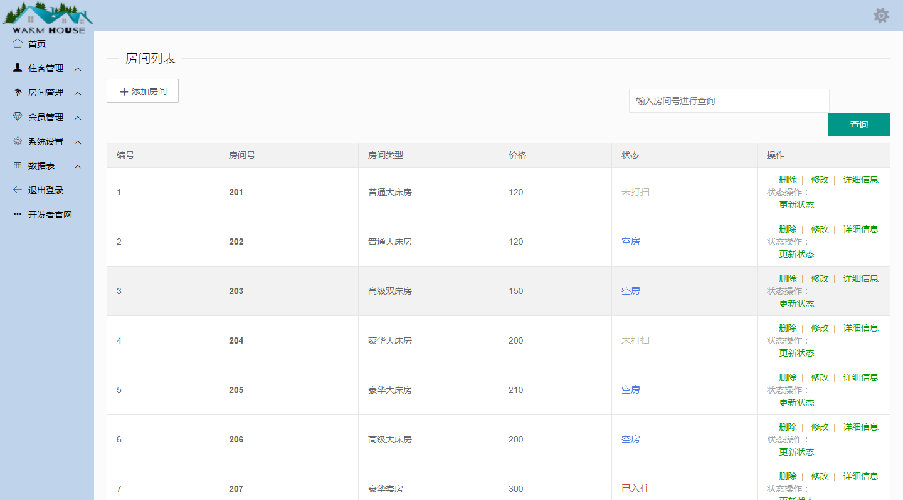
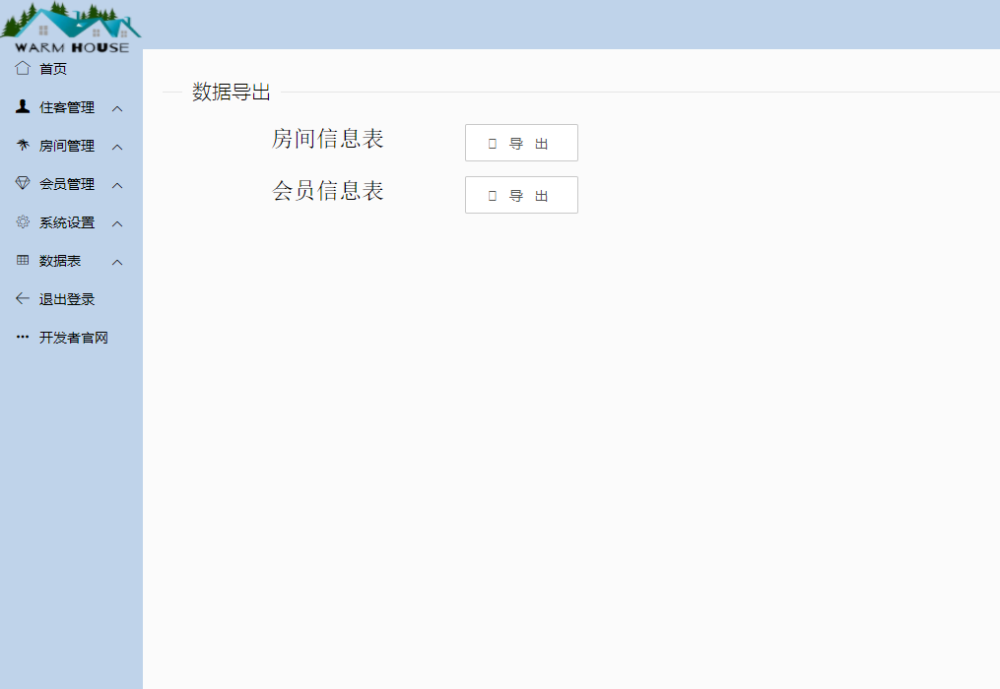
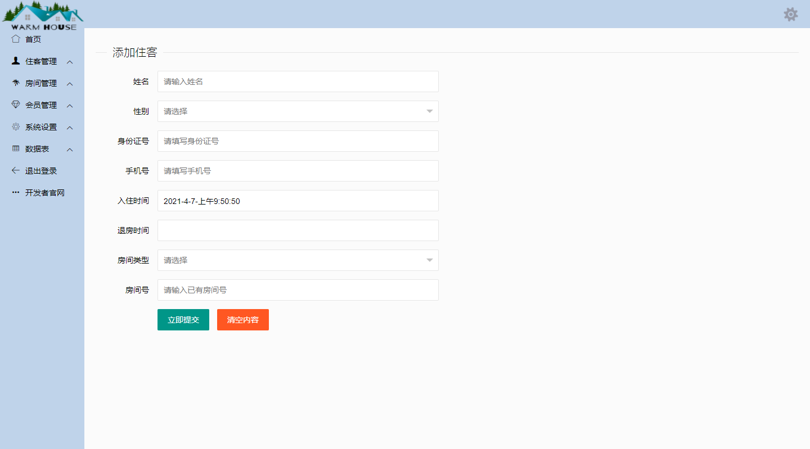
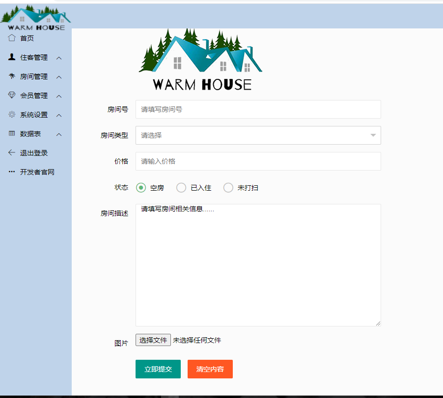
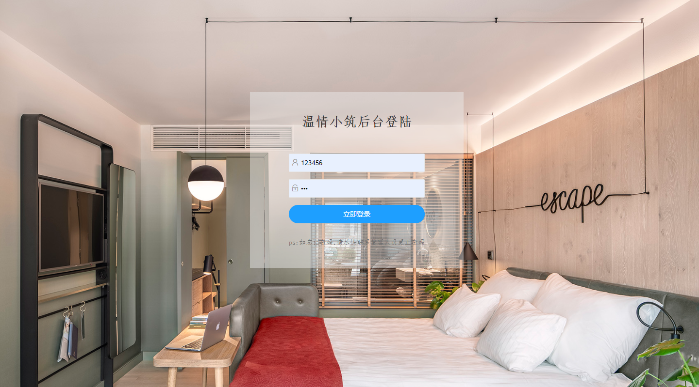
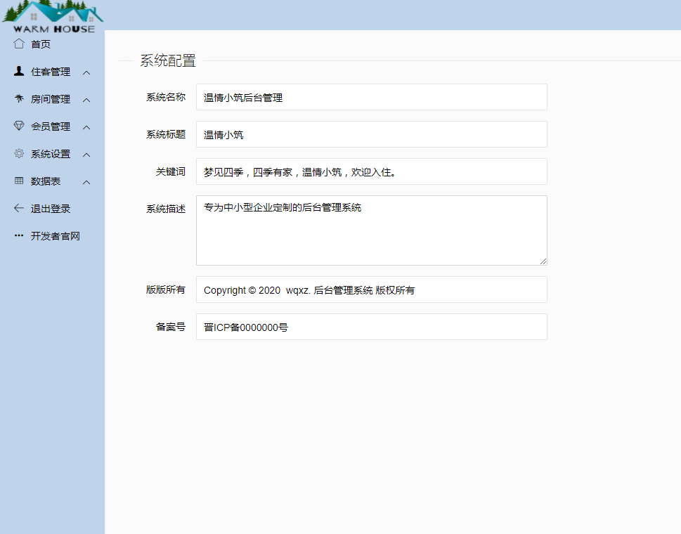

本系统是一个基于ssm的在线旅店管理系统

项目代码已收录公众号【java项目源码】，需要请自行关注一下公众号并下载源码

本系统主要功能为：

管理员登陆，住客管理（入住，列表），房间管理，会员管理（录入，列表），系统设置（网站信息，修改密码，清除缓存）
，数据导出（房间信息导出和会员信息导出）

技术：ssm+layui+mysql+tomcat+maven

注意：idea运行时需要将tomcat应用名改为\

CSDN博客地址：[基于ssm的在线旅店管理系统](https://blog.csdn.net/mataodehtml/article/details/115479243)

运行视频地址：[基于ssm的在线旅店管理系统](https://www.bilibili.com/video/BV1kB4y1P7Jq)

管理员：

